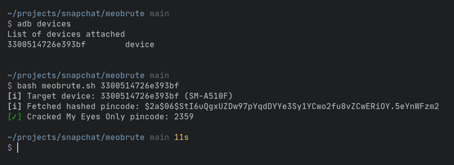
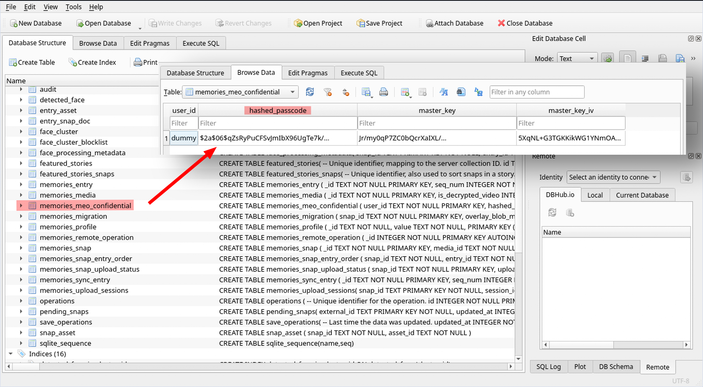

<h1 align="center">meobrute</h1>
<p align="center">
Automate the proccess of brute forcing the My Eyes Only pin code on Snapchat
<br>
<br>

<br>
<b> This script only works for rooted Android devices! </b>
<br>

## Dependencies
- [`adb`](https://developer.android.com/studio/command-line/adb)
- [`hashcat`](https://hashcat.net/hashcat/)

This script was tested on an Android device running Android 10 with LinageOS with Snapchat
v11.71.1.39

## How it works (_[Demo on YouTube](https://www.youtube.com/watch?v=uokcG95hqj0)_)
Snapchat saves the 4 digit My Eyes Only (MEO) pincode encrypted using [bcrypt](https://en.wikipedia.org/wiki/Bcrypt) in `/data/data/com.snapchat.android/databases/memories.db`.



Once you've gotten the hash and saved it into a file (eg.`meohash.txt`), you can use `hashcat` to brute force it using the following command:
```
hashcat --attack-method 3200 --attack-mode 3 meohash.txt "?d?d?d?d"
```

This is not a security vulnerability of a sort because Snapchat needs a place to store the hashed
pincode so that the user can log into their MEO. But what could be done is to use a salt to make
more difficult to crack.

The only real scenario of using this script would be if an attacker has managed to gain a victim's
Snapchat login credentials (example: through phishing) and then log in to a rooted Android device
so that they can use this script to gain access to the photos and videos in the victim's MEO.
